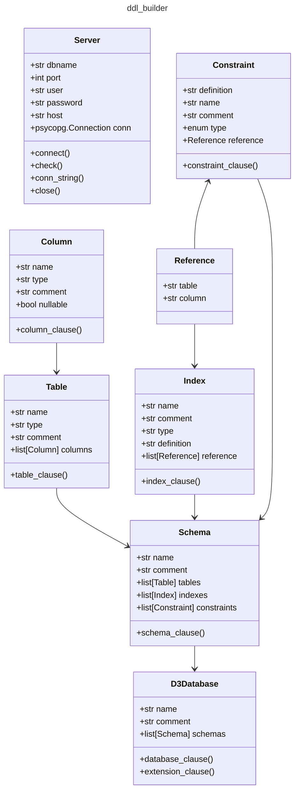

# DDL Builder

Given a database, defined using the YAML template in the `data_model` repository, the DDL Builder repository
is designed to create the database DDL (the SQL definition of the database structure). The goal of this repository is to provide a testing
environment for our data models, and to help provide a toolset to manage ongoing changes to the database as the data model evolves over time.

## DDL Workflow

When a change is made to the data model, and that change is approved through a push to the `production` or `devel` branch (the change has been suggested and vetted), then a GitHub action will trigger the workflow in this repository, pulling the Docker container, creating the database and adding extensions, and then building the schema and tables as defiined by the YAML files within `data_model`. A sample of [a valid yaml file](./examples/output.yaml) is found in the [`examples` folder](./examples/).

On a successful run this repository will return a signal that indicates the data model is clear, no errors exist and that all references and indexes function as expected. Based on this, the database itself would be ready to deploy to a production environment.

```bash
uv run ddl-builder ./examples/output.yaml -o examples/ddl_model.yaml -d examples/docs
```


At the end of deployment we should have a database (that can be created and destroyed) that has been built without errors, and a log of the build process written to the user's directory.

## Class Structure

The package uses a structure similar to SQLAlchemy, with individual classes for tables, schema, the database, indexes, etc. Where this differs from SQLAlchemy is that this project aims only to convert classes into Postgres-specific SQL, and to structure calls in a way that we support valid deployment of the SQL to an existing server.



The nested classes do not explicitly link, except through the `Reference` class and through membership in the various lists. So, for instance, an `Index` class does not *know* of the presence of a particular table within the same scema. We do perform validation throughout however, to check whether or not tables are present, or if constraints are linked.

## Testing

Tests use `pytest` with an HTML report written to `docs/test_report.html` to provide ongoing oversight of the project and potential issues. We use `pydantic` for class and variable validation throughout, to ensure that error messages and data validation tests can be run effectively on all methods and classes.

## Quick Start

Given the example file, we can build valid SQL using the command:

```
uv run ddl_builder
```