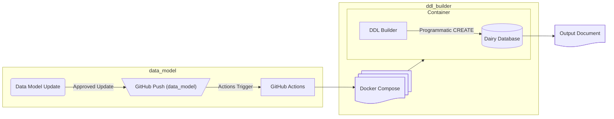

# DDL Builder

Given a database, defined using the YAML template in the `data_model` repository, the DDL Builder repository
is designed to create the database within a Docker container. The goal of this repository is to provide a testing
environment for our data models, and to help provide a toolset to manage ongoing changes to the database as the
data model evolves over time.

## DDL Workflow

When a change is made to the data model, and that change is approved through a push to the `production` branch (the change has been suggested and vetted), then a GitHub action
will trigger the workflow in this repository, pulling the Docker container, creating the database and adding extensions, and then building the schema and tables as defiined by the YAML files within `data_model`.

On a successful run this repository will return a signal that indicates the data model is clear, no errors exist and that all references and indexes function as expected. Based on this, the database itself would be ready to deploy to a production environment.

At the end of deployment we should have a database (that can be created and destroyed) that has been built without errors, and a log of the build process written to the user's directory.

## Testing

Tests use `pytest` with an HTML report written to `docs/test_report.html` to provide ongoing oversight of the project and potential issues.
